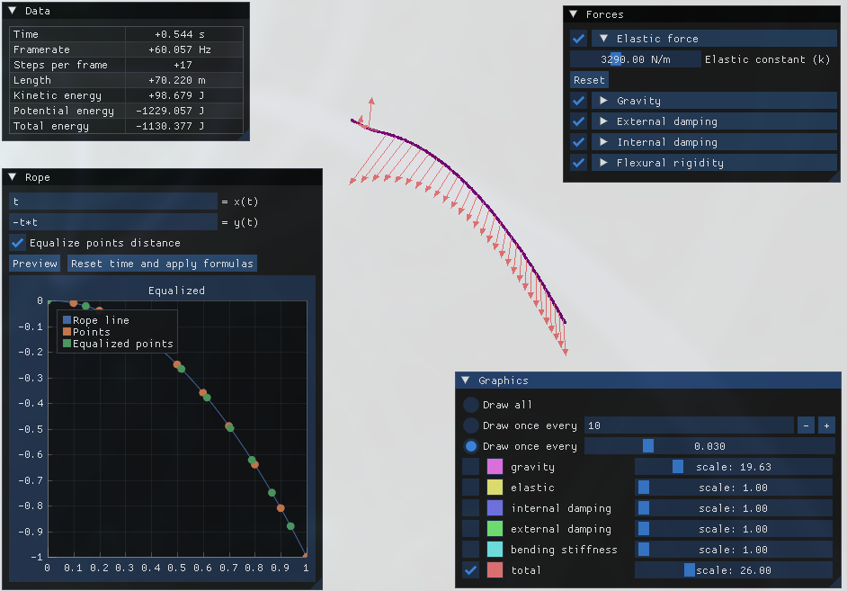

# Ropes
`Ropes` is a rope simulator.
It currently takes into account the following forces, which can be disabled if desired:
- the _gravitational force_ on the rope
- the _elastic force_ due to rope compression or elongation of the rope
- the _external friction_ due to air, linear in the tangential velocity of the point
- the _bending stiffness_ (aka _flexural rigidity_) of the rope which opposes to the bending
- the _internal friction_ of the rope fibers, loosely modelled as a linear damping in the
    radial velocity of the point compared to its neighbors

Each force is modelled in a simple way and only accounts for the first neighbors, so it may not be
the most accurate simulation in the world. Still pretty cool though, at least if you like ropes.



## Getting started (Build from source)
`ropes` requires the following dependencies:
- A compiler supporting at least `c++23`
- `SDL2` and `OpenGL` for the graphics
- `conan` (at least v2) to install the library dependencies
- `CMake` to generate and compile the project
- (optional) the `mold` linker - you can avoid it if you edit the CMakeLists.txt

To compile the project, move into `ropes/` and run
```bash
# install dependencies via conan
conan install . --output-folder=build --build=missing --settings=build_type=Release
# generate
cmake --preset conan-release
# and compile
cmake --build --preset conan-release
```

To test your build, you can launch `ropes` with the following configuration 
```bash
ropes -n=200 --dt=0.001 --duration=250 --total-length=70 -x="t" -y="-t*t"
```


## Usage
### CLI options
Usage: `ropes [flags] [options]`

Flags:
- `-p`, `--pause`: start the graphics, but pause the simulation

Options:
(note: if only the short option is written, the long is the same, i.e. `-x` -> `--x`)
- `-n`: number of points composing the ropes
- `-k`: elastic constant of the rope in _N/kg_, used to compute the elastic force
- `-E`: Young modulus of the rope in _GPa_, used to compute the bending stiffness of the rope
- `-b`: external damping coefficient in _N*s/m_, used for air resistance
- `-c`: internal damping coefficient in _N*s/m_, used for internal friction
- `-t`, `--total-length`: the total rope length in _m_
- `-d`, `--diameter`: the rope diameter in _mm_, used to for the bending stiffness
- `-l`, `--linear-density`: the rope linear density in _kg/m_
- `--dt`: the timestep for the simulation in _s_
- `--duration`: the total duration of the simulation in _s_
- `--fps`: the graphics framerate in _Hz_. Will cap at _60 Hz_
- `-x`: a function of a variable `t` that will be used for the rope shape - see later
- `-y`: a function of a variable `t` that will be used for the rope shape - see later
- `-h`, `--help`: show a recap of these flags and options

Notes:
- The [CLI library](https://github.com/p-ranav/structopt/tree/master) I'm using is very handy but
not very customizable, nor precise. It is not possible to comment the options nor to choose the
short and long parameter names, and (as you can see in `--help`) some short params are repeated -
I recommend to always use long names to avoid errors.
- I know the elastic force may be rewritten in terms of `E` instead of `k`, but at the moment
realistic values for `E` do not translate well in good values for `k`, so at the moment I'm stuck
with both of them.

Example:
```bash
ropes -n=200 --dt=0.001 --duration=25 --total-length=70 --pause -x=t -y="-t*t"
```

### User Interface
The User Interface (UI) is currently composed of four section:
- The **canvas**, where the rope is drawn. Currently the color of the rope is loosely proportional to
    the elastic energy for each point.
    While the canvas is in focus, you get the following keybindings:
  - `q`: exit the program
  - `p`: pause / unpause the simulation
  - `s`: pause the simulation and proceed of a single frame
  - `r`: reset the simulation to `t = 0.0 s`
  - `R`: reset and also pause
  - Directional arrows: move the camera around the canvas
  - `+`/`-`: change the zoom level of a factor `±0.1`
- The **Data** window, where you can see some quantities in real time
- The **Forces** window, where you can edit in real time all the constants of the simulation or
    even enable or disable forces
- The **Rope** window, where you can define a new shape for the rope and restart the simulation
- The **Graphics** window, where you can choose which forces to render, their number, scale and color

### Rope shape
The initial shape of the rope can be defined via the CLI parameters `-x` and `-y` or using the input
boxes in the **Rope** window.
You can write an expression of _t_ for _x_ and _y_ with domain $[0,1]$:
```math
x(t) = \text{an expression of t}
```
```math
y(t) = \text{another expression of t}
```
An _expression_ may be composed of the following tokens:
- integers or real numbers
- the _t_ parameter
- the mathematical constants `pi` (also spelled `π`) and `e`
- the binary operators `+`, `-`, `*`, `/`, `^` (power), `%` (modulus)
- the unary functions `sin`, `cos`, `tan`, `asin`, `acos`, `atan`, `ln`, `exp`, `abs`, `sqrt`, `cbrt` (cube root)
- round parenthesis
The order in which operations are evaluated is the usual one - blocks surrounded parenthesis, then functions,
    `^`, `*` and `/`, `+` and `-`, `%`.
If both $x(t)$ and $y(t)$ are formally correct, we'll get a function $r(t) = \left(x(t), y(t)\right)$.
To get the shape of the rope, the function $r$ will be evaluated for `n` points in the range $[0,1]$.
You can choose one of the following methods to generate the points:
- $P$ will be generated increasing $t$ linearly from $0$ to $1$. The resulting shape may be not
    omogeneous, meaning there may be less distance between some pair of points than between others.
    For example,
    ```math
    r(t) = (t^2, t^2)
    P₀ = r(0) = (0,0)
    P₁ = r(0.1) = (0.01,0.01)
    P₉ = r(0.9) = (0.81,0.81)
    P₁₀ = r(1) = (1,1)
    d(P₀,P₁)  = 0.01414...
    d(P₉,P₁₀) = 0.26870...
    ```
    A disomogeneous rope will obviously be subjected to different elastic forces along its length
- $P$ will be generated such that the distance between each pair of adjacent points will be the same.
    With this method the axial elastic force will initially be null along the rope.
You can choose which method to use by selecting the `Equalize points distance` checkbox.

## Project structure
In the following lines I'll write `filename` to indicate the pair `include/filename.hpp` and
`src/filename.cpp`, or the whole path if I want to specify a single file. Usually all the template
function are located in an header file, while all concrete implementations will be in a `.cpp` file.

The main logic of the simulation is located in `simulation`, where a Runge-Kutta 4 is
performed over the rope to compute the new state after the acceleration due to all the forces enabled.
Here is also located the code to generate the rope from a function.
To read the code, it is probably better to learn about the `math::vector` class from `include/math.hpp`
and all the physical quantities that will be used from `include/physics.hpp`.
The `graphics` exposes all the stuff relative to SDL, ImGui and the UI in general.
The code to parse the mathematical expression is in `expression` - it's a refactor of an old project
of mine, please don't be too stingy about it.
Finally, `src/main.cpp` is a damn mess: at first the CLI arguments are parsed, then the first shape
of the rope is generated, and inside the main loop all the SDL and ImGui events are processed before
drawing the canvas and the UI.
